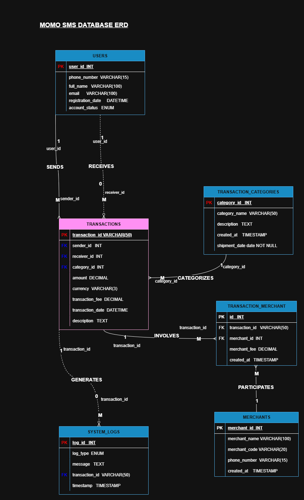

MoMo SMS Data Analytics Platform
Team Name: EWD-9

## Team Members

Dianah Shimwa Gasasira
Ayobamidele Aiyedogbon
Jesse Nkubito

## Project Description
An enterprise-level fullstack application designed to process, analyze, and visualize Mobile Money (MoMo) transaction data from SMS messages in XML format.

## System Architecture



## Scrum Board

Project management board:
https://trello.com/invite/b/6974c6a491ac69b3a7ae1e9d/ATTI0519622accf2cd969e01069b3bd6cffa319040E2/my-trello-board

## Project Structure

```
.
├── README.md                         # Project documentation and setup guide
├── .env.example                      # Environment variables template (DATABASE_URL or SQLite path)
├── requirements.txt                  # Python dependencies (lxml/ElementTree, dateutil, FastAPI optional)
├── index.html                        # Dashboard entry point (static HTML)
├── web/
│   ├── styles.css                    # Dashboard styling and CSS
│   ├── chart_handler.js              # JavaScript for fetching and rendering charts/tables
│   └── assets/                       # Images, icons, and other static assets
├── data/
│   ├── raw/                          # Provided XML input files (git-ignored)
│   │   └── momo.xml                  # Source XML data file
│   ├── processed/                    # Cleaned/derived outputs for frontend
│   │   └── dashboard.json            # Aggregated data for dashboard consumption
│   ├── db.sqlite3                    # SQLite database file
│   └── logs/
│       ├── etl.log                   # Structured ETL processing logs
│       └── dead_letter/              # Unparsed/ignored XML snippets for debugging
├── etl/
│   ├── __init__.py                   # Python package initialization
│   ├── config.py                     # Configuration: file paths, thresholds, categories
│   ├── parse_xml.py                  # XML parsing logic (ElementTree/lxml)
│   ├── clean_normalize.py            # Data cleaning: amounts, dates, phone normalization
│   ├── categorize.py                 # Transaction type categorization rules
│   ├── load_db.py                    # Database operations: create tables + upsert to SQLite
│   └── run.py                        # CLI entry point: parse -> clean -> categorize -> load -> export JSON
├── api/                              # Optional (bonus feature)
│   ├── __init__.py                   # Python package initialization
│   ├── app.py                        # Minimal FastAPI application with /transactions, /analytics endpoints
│   ├── db.py                         # SQLite connection helpers and database utilities
│   └── schemas.py                    # Pydanti
